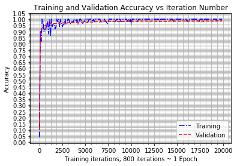
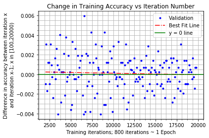
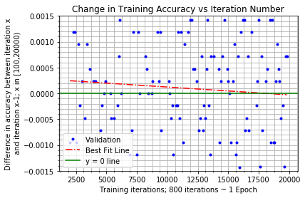

# Overview

This notebook is to select a value for the number of iterations used in model training for the architecture assessment. To select this value we will look at the training and validation accuracy data that resulted from assessing the output of the original Tensorflow Tutorial CNN architecture when run for 20,000 iterations. There are data points at every 100th iteration for the accuracy of the current (i.e. the 100th batch at iteration 100, the 200th batch at iteration 200, etc.) training batch and the entire validation set.

We want to select a number of iterations that is low enough to allow model training to be reasonably fast on a standard laptop but high enough that the rate of change of validation accuracy with respect to iteration number is small.


```python
%matplotlib inline
import numpy as np
import matplotlib.pyplot as plt
from matplotlib.ticker import MultipleLocator
```


```python
with open('datasets/validation.accuracy.txt', 'r') as f:
    validation = np.array(f.read().splitlines()).astype(np.float)
```


```python
with open('datasets/training.accuracy.txt', 'r') as f:
    training = np.array(f.read().splitlines()).astype(np.float)
```


```python
t = list(range(0, 20000, 100))
```


```python
plt.plot(t, training, 'b-.', t, validation, 'r--')

# get an axis handle
ax = plt.gca()
# set the grid on
ax.grid(True, which='both')
# add Major tick locations to the yaxis
locator = MultipleLocator(0.05)
ax.yaxis.set_major_locator(locator)

# set the plots y-axis limits
# plt.ylim([0.85,1.005])

# add labels to axes
plt.ylabel('Accuracy')
plt.xlabel('Training iterations; 800 iterations ~ 1 Epoch')
plt.title('Training and Validation Accuracy vs Iteration Number')

# add a legend to the plot
plt.legend(['Training','Validation'])

# turn minor ticks on
plt.minorticks_on()
```





From the figure above it is clear to see that the rate of increase in validation accuracy decreases with increasing iteration. We need to select a point where the rate of increase in validation accuracy is acceptably low. 

With this in mind, we will now plot the change in validation accuracy. The change in validation accuracy is calculated as:

dvalidation = validation[1:] - validation[0:-1] 

If we liken the calculation of dvalidation to a forward difference numerical derivative then dvalidation[0], which is equal to validation[1] - validation[0], corresponds to t[0]. Hence, we have the set of points: 

((t[0], dvalidation[0]), (t[1], dvalidation[1]), ..., (t[len(t)-2], dvalidation[len(t)-2]))

Or expressed another way there is no dvalidation[len(t)-1] to correspond to t[len(t)-1] (or t[-1] in Python notation).

In addition to a plot of the change in validation accuracy we will also plot a best fit curve for the data. The best fit will give us a view of the trend in the long term change in validation accuracy rather than the 100th iteration to 100th iteration change. 

When calculating a best fit we will:

* Ignore the first 20 data points
* Fit a 1st order polynomial (a straight line) to the remaining data points

## Ignoring the first 20 data points

We don't want to include data from early steps as we are interested in the trend of the validation accuracy once the network has had a chance to do some initial learning. From the plot above of 'Training and Validation Accuracy vs Iteration Number' it we can see that the validation accuracy is starting to level off roughly between iterations 1500 to 2000. We will be interested in the behaviour after this point. With that in mind, we will ignore the first 20 data points - i.e. we will take iteration 2000 as our first point in calculating a best fit line.

## Best fit line

We want to fit a line to the data points for t >= 2000. As we are ignoring the first 20 data points, we eliminate much of the 'tail' that comes from errors in the early stages of learning. With that in mind, we will try to fit a straight line to the remaining data to give us a view of the trend of the change in validation accuracy. 

Below we can see the plot of the change in validation accuracy alongside the best fit line. Above 18,000 iterations the best fit line indicates that the training accuracy will tend to get worse. This is just a consequence of using a line to fit to the data. 

We could try to fit a higher order polynomial but inspite of the unusual trend at higher values for training iteration the best fit line will still be sufficient for our purposes; specifically, view a high level trend out of the noisy data.

From the best fit line we can see that the change in accuracy is low for all values of t >= 2000. Balancing sufficient accuracy with minimal iterations would suggest from the graphs below that we could stop our model training after 5,000 - 7,500 iterations.

The best fit line evaluated for t = 5,000 is 0.0002 and for t = 7,500 is 0.00016. 

This means that for every 100 iterations over 5,000, we will see an increase of 0.0002 (or 0.02%) increase in training accuracy - an acceptably low rate; at least within the assumption of a linear fit to the data.

With this in mind, and considering the limited computational resources for the experiment, we will select 5,000 iterations (which is approximately 6 training epochs) as our number of iterations to run. 

The relatively low rate of change of validation accuracy at this point means that significant differences between the reported accuracy of different models should not be a result of too few iterations.


```python
# get the difference in validation accuracy
dvalidation = validation[1:] - validation[0:-1]

# fit a function to the data
# - select a value to start including data from
ex = 20
# - based on ex form the start and end points in the data that we can use.
#   tstart is ex, tend is len(t) - 1. 
tstart = ex
tend = len(t) - 1
# - fit the curve to the data. Fitting a 1st order polynomial (a line)
dvbf = np.polyfit(t[tstart:tend], dvalidation[tstart:tend], 1)
p = np.poly1d(dvbf)

# plot the dvalidation data alongside the fit polynomial
plt.plot(t[tstart:tend], dvalidation[tstart:tend], 'b.')
#plt.ylim([-0.005, 0.005])
plt.minorticks_on()
plt.plot(t[tstart:tend], p(t[tstart:tend]), 'r-.')
plt.gca().grid(True, which='both')
plt.gca().axhline(y=0.0, color='g')
plt.legend(['Validation', 'Best Fit Line', 'y = 0 line'])

# add labels and title
plt.xlabel('Training iterations; 800 iterations ~ 1 Epoch')
plt.ylabel('Difference in accuracy between iteration x\n and iteration x-1; x in [100,20000)')
plt.title('Change in Training Accuracy vs Iteration Number')
```


    Text(0.5,1,'Change in Training Accuracy vs Iteration Number')





```python
# plot the dvalidation data alongside the fit polynomial
plt.plot(t[tstart:tend], dvalidation[tstart:tend], 'b.')
plt.ylim([-0.0015, 0.0015])
plt.minorticks_on()
plt.plot(t[tstart:tend], p(t[tstart:tend]), 'r-.')
plt.gca().grid(True, which='both')
plt.gca().axhline(y=0.0, color='g')
plt.legend(['Validation', 'Best Fit Line', 'y = 0 line'])

# add labels and title
plt.xlabel('Training iterations; 800 iterations ~ 1 Epoch')
plt.ylabel('Difference in accuracy between iteration x\n and iteration x-1; x in [100,20000)')
plt.title('Change in Training Accuracy vs Iteration Number')
```


    Text(0.5,1,'Change in Training Accuracy vs Iteration Number')





```python
(p(5000), p(7500))
```


    (0.00019871019396145909, 0.00016066189190885725)


